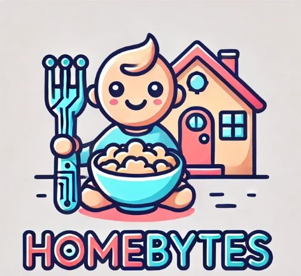

# ByteTrack
### Automatic Bite Detection in Children as a part of HomeBytes project
<div style="display: flex; align-items: center;">
    
    
</div>


## Table of Contents
- [Introduction](#introduction)
- [Approach](#approach)
  - [Face Detection](#face-detection)
  - [Bite Classification](#bite-classification)
- [Dataset](#dataset)
- [Project Structure](#project-structure)
- [Getting Started](#getting-started)
- [Usage](#usage)
- [Results](#results)
- [Status](#status)
- [License](#License)
- [HomeBytes Study information](#HomeBytes-study)
- [Contact Information](#contact-info)
- [Acknowledgments](#acknowledgments)

## Introduction

This project presents one of the first automated systems for detecting eating bites in children during meal times. Our aim is to develop a robust, high-accuracy bite detection model for use in video-recorded meal settings. We collected and analyzed in-lab meal videos featuring children aged 7-9 (n=242 videos train set; n=94 children) across four portion sizes.

The videos present unique challenges, as they capture natural, often noisy behavior in children, including frequent movement, occlusions, and varied eating styles. These factors introduce significant variability in the data, making automated bite detection particularly challenging. ByteTrack aims to overcome these complexities, enabling accurate bite detection even in noisy, real-world video settings.

## Approach

The system uses a multi-stage deep learning architecture optimized for accurate detection and classification:

### 1. Face Detection
   - **Primary Model**: [YOLOv7](https://github.com/WongKinYiu/yolov7), known for its speed and accuracy in object detection tasks, serves as our primary face detection model.
   - **Fallback Model**: [Faster R-CNN](https://arxiv.org/abs/1506.01497), a reliable choice for handling challenging cases where YOLOv7 might miss a detection.

### 2. Bite Classification
   - **Feature Extraction**: [EfficientNet](https://arxiv.org/abs/1905.11946) is employed for extracting high-level spatial features from detected face regions, ensuring compact yet expressive feature representations.
   - **Temporal Analysis**: An LSTM model processes these features over time to differentiate between bite and non-bite moments, capturing subtle temporal cues inherent in eating behavior.

## Dataset

Our dataset consists of in-lab videos, where children were provided set meals with either a human reader (researcher) or audiobook. Camera angles are from the top corner (see room orientation below) providing comprehensive coverage of varying portion sizes and eating styles among children. Ground truths for the study are manually annotated timestamps using [Noldus Observer XT](https://link.springer.com/article/10.3758/BF03203406) from 2 researchers by visual observations, using a set [protocol](https://pmc.ncbi.nlm.nih.gov/articles/PMC8671353/).

<div style="display: flex; align-items: center;">
    
    
</div>

## Project Structure

- **Face Detection**: YOLOv7 and Faster R-CNN configurations and weights.
- **Bite Classification**: EfficientNet for feature extraction, followed by LSTM for sequential bite classification.
- **Utilities**: Helper functions for video preprocessing, annotation, and data handling.
- **Configuration Files**: YAML files for model paths, hyperparameters, and relative paths for easy integration.

## Getting Started
## Setup
Follow these steps to set up your environment for ByteTrack.

1. Clone the ByteTrack Repository
To get started, clone the ByteTrack repository with the custom YOLOv7 submodule. This setup ensures that YOLOv7, customized for our dataset, is available in the YOLOv7_custom folder inside the ByteTrack directory.

```bash
git clone --recurse-submodules https://github.com/YashuBhat96/ByteTrack.git
cd ByteTrack
```
Our pipeline depends on YOLOv7. The customized YOLOv7 repository is available here: [YOLOv7_custom](https://github.com/YashuBhat96/Yolov7_custom_ByteTrack.git).

## 2. Set Up the Environment
Choose one of the following methods to set up the environment:

#### **A. Using the Environment File**:
For a reproducible setup, use the ByteTrack_env.yml file to create a Conda environment with all necessary dependencies.
```bash
conda env create -f ByteTrack_env.yml
conda activate ByteTrack
```
#### **B. Using requirements files**:

Deployment Environment: To set up an environment to use the model on your videos, install dependencies from the deployment requirements file.

```bash
pip install -r deploy_requirements.txt
````
OR 

#### **Development Environment**: To set up an environment to develop your model, install dependencies from the development requirements file.

```bash
pip install -r dev_requirements.txt
````
## 3. Configuration File (config.yaml)

The `config.yaml` file is essential for managing various settings in ByteTrack, such as file paths, model parameters, and other configurations needed for the bite detection pipeline.

### 1. Purpose of `config.yaml`

The configuration file is used to:
- Define paths for model weights, data files, and output directories.
- Set model parameters, such as thresholds and detection parameters.
- Manage other customizable options for running the pipeline.

### 2. Installing and Setting Up `config.yaml`

The repository should contain a sample configuration file, `config.yaml`, which you can customize to fit your environment. To set it up:

1. Locate `config.yaml` in the repository root.
2. Open the file in a text editor and modify the paths and parameters as needed. 

   For example:
   ```yaml
   model_weights: "path/to/weights.pt"
   data_path: "path/to/dataset/"
   output_dir: "path/to/output/"
   threshold: 0.5
   ```
   
## Usage

Once your environment is set up and config.yaml is configured, you’re ready to run ByteTrack.

### Running the Main Script

1. **Activate the Environment (ByteTrack_env)**: Make sure the ByteTrack environment is active.

   ```bash
   conda activate ByteTrack_env
   ```
   
2. **Run the main script:** The main script, ByteTrack_main.py, handles the entire bite detection process.
   
Within the ByteTrack environment, open ByteTrack repo. 

   ```bash
    python ByteTrack_main.py --config config.yaml
   ```

## Results

## Status 

## License 
This project is licensed under the MIT License - see the [LICENSE](LICENSE) file for details.

## HomeBytes Study Information
This study serves as a proof-of-concept aimed at assessing whether eating behaviors observed in a controlled, in-lab setting can be translated to free-living conditions (at home). Our primary goal is to evaluate the validity of bite detection and intake patterns outside the lab by comparing in-lab and at-home bite rates as well as cumulative intake curves.

ByteTracker is an innovative deep-learning and computer vision-based tool designed for automatic bite detection in children. By automating the process of bite detection, ByteTracker significantly reduces labor and time costs associated with manual observations. This study focuses on:

Comparing Manual vs. AI-Based Detection: We plan to assess ByteTracker's accuracy against traditional manual annotations (gold-standard) to validate its performance.
Evaluating Lab vs. Home Conditions: We plan to explore the consistency of bite rate and intake patterns in controlled versus free-living environments, assessing ByteTracker's applicability beyond the lab.

ByteTracker represents a step forward in leveraging AI to streamline eating behavioral analysis, aiming to enhance the scalability and practicality of dietary studies in real-world settings.

## Contact Information

Contributors
This project is a collaborative effort by a team with expertise in computer vision, children's eating behavior analysis, food science, and nutrition at The Pennsylvania State University.

**Yashaswini Rajendra Bhat**  
Main Contributor/First Author, PhD Candidate, Department of Nutritional Sciences, Penn State  
Email: [ybr5070@psu.edu]  
LinkedIn: [Yashaswini Bhat](https://www.linkedin.com/in/yashubhat/)  
X: [@YashuBhat](https://x.com/YashuBhat)  

**Dr. Timothy R. Brick**  
Main Technical Advisor, Co-Principal Investigator (Co-PI), Associate Professor, Department of Human Development and Family Studies, ICDS Faculty Co-Hire, Penn State  
Email: [tbrick@psu.edu]  
RealTime Science Lab: [https://sites.psu.edu/realtimescience]  

**Dr. Kathleen L. Keller**  
Co-Principal Investigator, Department of Nutritional Sciences and Department of Food Science, Penn State  
Email: [klk37@psu.edu]  
X: [@KatKellerLab](https://x.com/katkellerlab)  
Children's Eating Behavior Lab: [https://hhd.psu.edu/nutrition/childrens-eating-lab/facility]  

**Dr. Alaina L. Pearce**  
Principal Investigator (PI), Department of Nutritional Sciences, Penn State  
Email: [azp271@psu.edu]  
X: [@AlainaPearce](https://x.com/AlainaLPearce)  
Cogneato Lab: [https://sites.psu.edu/alainapearce]  

Manual annotation contribution by Dr. Nicholas Neuwald, University at Buffalo.

## Ackowledgments
Initial funding from Institute of Computational and Data Sciences, Penn State
